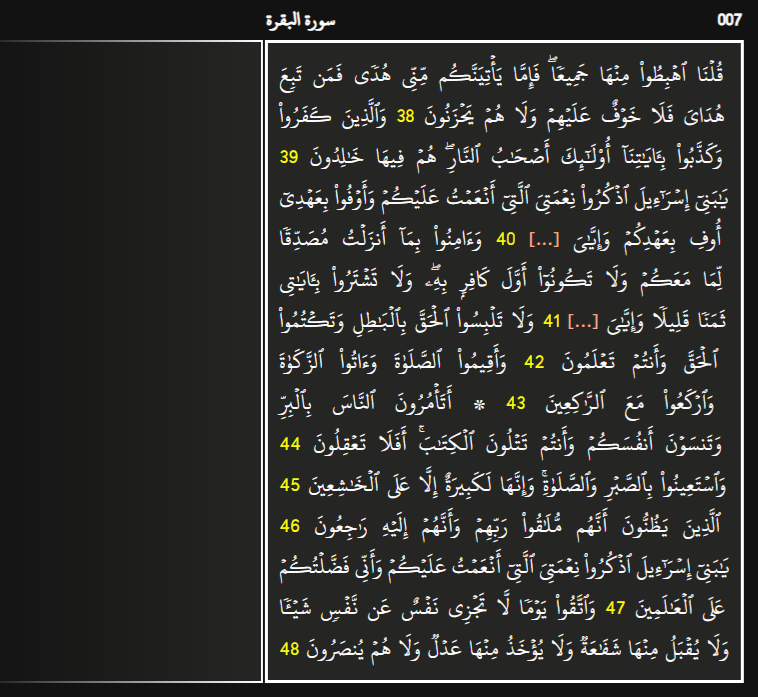

رزمة QuranCloze هي رزمة أنكي (Anki deck) تحتوي صفحات القرآن الكريم معدة بشكل يسمح للمستخدم بأن يقوم بإنشاء بطاقات من نوع ملء الفراغات (Cloze) ومراجعتها بسهولة.
## المزايا
- تحتوي الرزمة على 604 ملحوظة (Note) بعدد صفحات المصحف الشريف، ولكنها لا تحتوي أي سؤال مبدئيا، فعلى المستخدم أن يقوم بإنشاء أسئلة للكلمات أو الآيات التي يريد مراجعتها، وذلك بأن يقوم بتحديد النص الذي يريده وهو معد مسبقا، ثم الضغط على زر [...] لإخفاء النص المحدد.
- بعدما يجيب المستخدم على أي بطاقة، تظهر له الصفحات السابقة والصفحات التالية للموضع الذي راجعه في هذه البطاقة، حتى يتسنى له النظر في سياق الآيات إذا احتاج إلى ذلك.
- هناك تحسينات بصرية وتمييز لأرقام الآيات واتجاه الصفحة يمينًا أو يسارًا، وغير ذلك، وهذا يساعد الذاكرة البصرية، وهناك أيضا دعم للوضع الداكن.
- الرزمة منظمة باستخدام الوسوم (Tags)، وهناك وسوم لأجزاء القرآن الكريم، ووسوم أخرى للسور.
## لقطات الشاشة

## كيفية الاستخدام
### في البداية
1. قم بتحميل الرزمة من [AnkiWeb](https://ankiweb.net/shared/info/555820561) أو من [GitHub](https://github.com/ah-hamed/QuranCloze/releases) ثم استوردها.
2. افتح متصفح البطاقات وقم بتعليق (Suspend) جميع ملحوظات الرزمة، إن لم تكن معلقة بالفعل.
	- يمكنك التأكد من ذلك إذا وجدت جميع البطاقات مظللة باللون الأصفر في متصفح البطاقات 
	- 
### كيف تنشئ بطاقة؟
1. قم بإلغاء تعليق (Unsuspend) الملحوظات التي تحتوي صفحات القرآن الكريم التي تريد دراستها.
	- على سبيل المثال نقوم بإلغاء تعليق الصفحة رقم 10 
	- 
2. قم بتحديد النص الذي تريد أن تراجعه في حقل السؤال (Question) سواء كان آية أو أكثر أو جزءا من الآية أو كلمة، ثم قم بالضغط على زر [...] أو اضغط. 
> [!CAUTION] انتبه
> تأكد أنك تقوم بتعديل حقل السؤال (Question) وليس حقل السياق (Context). ويفضل أن تقوم بجعل حقل السياق مطويا (collapsed) بشكل افتراضي، وذلك من خلال (الأدوات > إدارة أنواع الملحوظات)

### كيف تخفي أكثر من موضع في نفس الصفحة؟
إذا أردت أن تحدد جزئين أو أكثر متباعدين عن بعضهما في نفس الصفحة، فأعط لهم نفس رقم البطاقة، والذي يكون مكتوبا بعد حرف c، مثل c1, c2 وهكذا.

### كيف تحذف بطاقة؟
#### على الحاسوب
1. قم بحذف الأقواس الخاصة بملء الفراغات، مع إبقاء النص القرآني الذي بينها.
	- 
2. قم بحذف البطاقات الفارغة، وتأكد من تفعيل خيار الإبقاء على الملحوظات التي ليس لها بطاقات صالحة.
> [!CAUTION] انتبه
> إذا لم تقم بتفعيل هذا الخيار، قد تفقد جميع الملحوظات التي لم تدرسها بعد!

#### على الأندرويد
1. نفس الخطوة 1 كما على الحاسوب.
2. فيما يتعلق بخطوة 2، فتطبيق أنكيدرويد لا يدعم حتى الآن خاصية الإبقاء على الملحوظات التي ليس لها بطاقات صالحة، لذا قد نلجأ لحل بديل، وهو أن تقوم بتعليق البطاقة الفارغة عندما تظهر أمامك أثناء المراجعة على سبيل المثال

### ماذا لو حذفت ملحوظة أو جزءا من النص القرآني بالخطأ؟
توجه إلى [هذه الصفحة](https://htmlpreview.github.io/?https://github.com/ah-hamed/QuranCloze/blob/main/copy_a_page.html) وقم بجلب ما فقدت.
## نصائح إضافية
- للحصول على عرض أفضل للبطاقات على متصفح بطاقات الأندرويد، يمكنك تفعيل خيار "اقتطاع المحتوى"
	
## المصادر
- النص القرآني والخط المستخدم:
	- خط النسخ الحاسوبي - حفص - مجمع الملك فهد لطباعة المصحف الشريف - النسخة رقم 18

لا تنسونا من صالح دعائكم